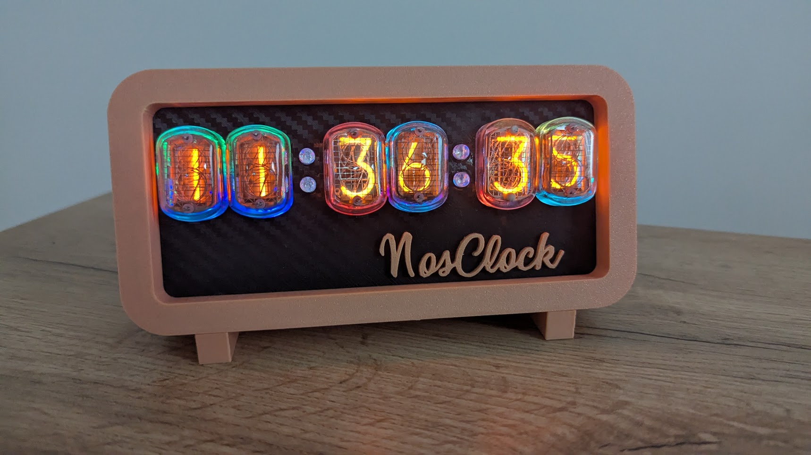
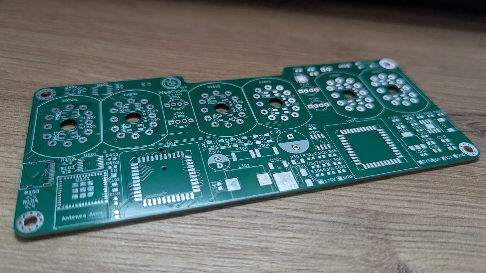
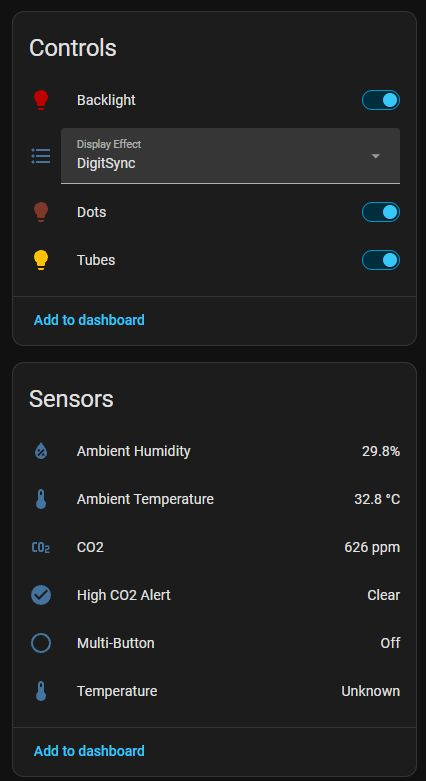
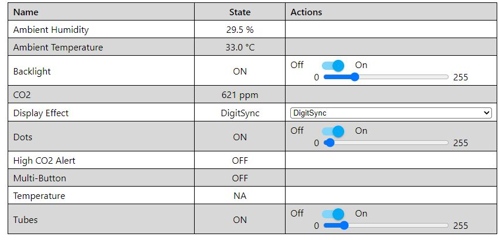

# NosClock

[](https://send.monobank.ua/jar/8Sp4xhmNX3)

**NosClock** is a smart 6-digit Nixie tube clock that seamlessly bridges **authentic retro aesthetics with cutting-edge modern electronics**. Powered by the **ESP32-C3** RISC-V microcontroller, it pairs iconic vintage **[IN-12 cold-cathode Nixie display tubes](https://s.click.aliexpress.com/e/_c3cIzvbx)** with state-of-the-art integrated circuits — including high-voltage shift register drivers, precision RTC timekeeping, addressable RGB LEDs, and expansion options for environmental sensors.

By combining retro industrial charm with modern IoT capabilities, NosClock runs on **ESPHome** for native Home Assistant smart home automation, offering dynamic visual backlighting effects and customizable sensors.

The custom hardware PCB was designed in **KiCad**, and the matching enclosure was designed in **Autodesk Fusion 360**. The hardware features an onboard 170V DC high-voltage boost converter, high-side anode switching, 32-channel shift register drivers, and efficient power regulation from a single 12V DC input.

> [!CAUTION]
> **HIGH VOLTAGE WARNING**: This hardware generates **170V DC** high voltage to power the Nixie tubes. High voltage can cause severe electric shock, serious injury, electrocution, or property damage. **Do not touch open PCB contacts or high-voltage nodes while powered.** Always ensure power is completely disconnected before touching, servicing, or modifying the hardware.



---

## ✨ Key Features

- **Flicker-Free High-Voltage Shift Register Driving**:
  Utilizes dedicated high-voltage shift register decoders (**HV5222PJ**) instead of traditional tube multiplexing. This eliminates high-frequency display flickering completely, significantly enhancing visual perception and comfort. Additionally, direct driving allows reaching ultra-low minimum tube brightness levels, perfect for an unobtrusive night mode.

- **Dual RGB LEDs per Digit & Addressable RGB Colons**:
  Each Nixie tube digit socket is illuminated by **two independent SK6812 MINI addressable RGB LEDs**, and every colon dot is also an RGB LED (4 colon dots driven via the **AW9523B** I2C driver). This dual-LED configuration unlocks rich visual lighting effects (*DigitSync*, *Aurora*, *Scanner*, *ProgressBar*) with fine-grained color control.

- **Smart Home Integration (Home Assistant via ESPHome)**:
  Full native ESPHome integration allows seamless remote control of tube brightness, backlighting colors, effects, and display power directly from Home Assistant. Enables powerful smart home automations such as:
  - **Air Raid Alerts (Повітряна Тривога)** visual flashing notifications.
  - **High CO2 Warnings** (automatic visual alert when indoor CO2 levels rise).
  - **Night Mode Automation** (automatically reducing brightness during sleeping hours).

- **Dual Time Synchronization (NTP + Battery-Backed RTC)**:
  Time is automatically synchronized via **NTP** over Wi-Fi whenever an internet connection is available. For offline reliability and power loss recovery, an onboard Real-Time Clock (**DS3231MZ / DS1307**) powered by a CR1220 backup battery maintains continuous timekeeping.

- **Expandable External I2C Sensor Interface**:
  Features a dedicated onboard 4-pin I2C expansion connector (`J103`), enabling effortless connection of additional hardware sensors — such as the **Sensirion SCD4x** CO2, temperature, and humidity sensor module for real-time indoor air quality monitoring.

---

## Technical Specifications

### Custom PCB & Hardware Architecture

NosClock is powered by a custom-designed printed circuit board (PCB) engineered in **KiCad**. The PCB integrates high-voltage boost conversion, high-side transistor switching, digital logic level conversion, addressable RGB backlighting, and sensor expansion onto a single compact board with optimized ground isolation.



#### Component Breakdown

- **Microcontroller**: Espressif [ESP32-C3-MINI-1](https://www.espressif.com/sites/default/files/documentation/esp32-c3-mini-1_datasheet_en.pdf) module (RISC-V 32-bit single-core CPU, 2.4GHz Wi-Fi 4, and Bluetooth 5 LE).
- **Nixie Display Tubes**: 6x **[IN-12B](https://s.click.aliexpress.com/e/_c3cIzvbx)** cold-cathode Nixie tubes arranged in 3 multiplexed digit pairs with anti-ghosting pre-blanking timing and automatic slot-machine digit burn-in protection sweeps.
- **High-Voltage Boost Supply**: Onboard step-up converter built around the [UC3843](https://www.ti.com/lit/ds/symlink/uc3843.pdf) current-mode PWM controller and [FQD12N20L](https://www.onsemi.com/pdf/datasheet/fqd12n20l-d.pdf) 200V N-channel MOSFET, converting 12V DC to **170V DC** for Nixie tube anodes.
- **Low-Voltage Power Supply**:
  - [MP2307](https://www.monolithicpower.com/en/documentview/productdocument/index/doc_url/%2Fm%2Fp%2Fmp2307_r1.9.pdf) 3A synchronous step-down buck converter stepping 12V DC input down to 5V DC.
  - [AP7361-33](https://www.diodes.com/assets/Datasheets/AP7361.pdf) 1A low-dropout (LDO) linear regulator converting 5V DC to 3.3V DC for the ESP32-C3 MCU and digital logic.
- **Display Driver & Logic**:
  - 2x Microchip [HV5222PJ](https://ww1.microchip.com/downloads/en/DeviceDoc/20005847A.pdf) 32-channel high-voltage open-drain shift registers in PLCC-44 sockets.
  - [CD4504](https://www.ti.com/lit/ds/symlink/cd4504b.pdf) CMOS hex voltage level shifter and [SN74LV1T34](https://www.ti.com/lit/ds/symlink/sn74lv1t34.pdf) logic buffer.
- **Timekeeping**: High-precision [DS3231MZ](https://www.analog.com/media/en/technical-documentation/data-sheets/DS3231M.pdf) / DS1307 I2C Real-Time Clock with CR1220 coin cell battery backup and automatic NTP synchronization.
- **Environmental Sensors**:
  - Sensirion [SCD4x / SCD41](https://sensirion.com/media/documents/48C4B71E/66432D15/Sensirion_CO2_Sensors_SCD4x_Datasheet.pdf) photoacoustic CO2, temperature, and relative humidity sensor (I2C address `0x62`).
  - Dallas [DS18B20](https://datasheets.maximintegrated.com/en/ds/DS18B20.pdf) 1-Wire digital temperature sensor on GPIO2.
- **RGB Underlighting**: 12x [SK6812MINI](https://mouser.com/datasheet/2/737/SK6812MINI_REV02_EN-1501726.pdf) addressable RGB LEDs under Nixie tube sockets, supplemented by 4x RGB colon LEDs driven by an [AW9523B](https://www.awinic.com/en/product-detail/AW9523B) 16-channel I2C LED driver.
- **User Interface Controls**: Physical multi-gesture push button on GPIO20 supporting single-click, double-click, and long-press interactions.
- **Power & Connectivity**:
  - 12V DC power input via 2-pin JST-XH terminal (`J104`).
  - USB-C connector (`J101`) for power and serial programming.
- **Enclosure**: Custom protective enclosure designed in **Autodesk Fusion 360** tailored specifically for the PCB dimensions and IN-12 Nixie tube arrangement.

---

## 🛒 Where to Buy (AliExpress Shopping List)

Quantities are taken from the NosClock PCB interactive BOM. Prices are in USD, checked on 2026-09-23. They are item prices only: shipping depends on your country and is not included.

- **Needed**: how many parts are placed on the board.
- **Order**: how many lots to buy × pieces per lot (sellers often sell only in packs of 2, 5, 10, etc.).
- **Total**: lot price × number of lots.

> **Note:** AliExpress prices change often, and listings can be removed or go out of stock. If a link is broken or a part is unavailable, please open an issue so the list can be updated.


### Nixie Tubes

| Part | Needed | Order | Lot Price | Total | Link |
|---|---|---|---|---|---|
| IN-12B (NOS) | 6 | 6 × 1 pc | $17.10 | **$102.60** | [buy](https://s.click.aliexpress.com/e/_c3cIzvbx) |

**Nixie tubes total: $102.60**


### Components

| # | Part | Reference | Needed | Order | Lot Price | Total | Link |
|---|---|---|---|---|---|---|---|
| 1 | ESP32-C3-MINI-1 (N4) | U101 | 1 | 1 × 1 pc | $2.73 | $2.73 | [buy](https://s.click.aliexpress.com/e/_c3xMgjCH) |
| 2 | DS3231MZ SOIC-8 | U103 | 1 | 1 × 2 pcs | $5.22 | $5.22 | [buy](https://s.click.aliexpress.com/e/_c3K8PI7B) |
| 3 | AP7361-33ER-13 SOT-223 | U201 | 1 | 1 × 10 pcs | $6.95 | $6.95 | [buy](https://s.click.aliexpress.com/e/_c3g1RG4p) |
| 4 | MP2307DN-LF-Z SOIC-8 | U202 | 1 | 1 × 5 pcs | $2.02 | $2.02 | [buy](https://s.click.aliexpress.com/e/_c3VXoHP7) |
| 5 | UC3843A SOIC-8 | U301 | 1 | 1 × 10 pcs | $1.62 | $1.62 | [buy](https://s.click.aliexpress.com/e/_c2Jymwnr) |
| 6 | CD4504BPWR TSSOP-16 | U401 | 1 | 1 × 5 pcs | $2.22 | $2.22 | [buy](https://s.click.aliexpress.com/e/_c3nhAJI1) |
| 7 | SN74LV1T34DBVR SOT-23-5 | U402 | 1 | 1 × 10 pcs | $2.27 | $2.27 | [buy](https://s.click.aliexpress.com/e/_c4NBrHu5) |
| 8 | HV5222PJ PLCC-44 | U501, U601 | 2 | 2 × 1 pc | $3.68 | $7.36 | [buy](https://s.click.aliexpress.com/e/_c4b2e8wd) |
| 9 | PLCC-44 SMD socket | U501, U601 | 2 | 1 × 5 pcs | $1.42 | $1.42 | [buy](https://s.click.aliexpress.com/e/_c301jgO5) |
| 10 | AW9523BTQR QFN-24 | U701 | 1 | 1 × 5 pcs | $1.54 | $1.54 | [buy](https://s.click.aliexpress.com/e/_c37MUf2v) |
| 11 | FQD12N20L TO-252 | Q301 | 1 | 1 × 10 pcs | $2.14 | $2.14 | [buy](https://s.click.aliexpress.com/e/_c3Ir5ABP) |
| 12 | ES1J SMA | D301 | 1 | 1 × 50 pcs | $0.38 | $0.38 | [buy](https://s.click.aliexpress.com/e/_c4tBW6Tn) |
| 13 | SK6812MINI 3535 ("BL" variant) | D501–D506, D601–D606 | 12 | 1 × 50 pcs | $5.63 | $5.63 | [buy](https://s.click.aliexpress.com/e/_c4mkH7AZ) |
| 14 | RGB LED 5 mm, 4-pin, common anode (Diffused A) | D701–D704 | 4 | 1 × 20 pcs | $1.36 | $1.36 | [buy](https://s.click.aliexpress.com/e/_c4UarZrj) |
| 15 | Inductor 10 µH, 0630 | L201 | 1 | 1 × 10 pcs | $1.53 | $1.53 | [buy](https://s.click.aliexpress.com/e/_c2QJm98H) |
| 16 | Inductor 100 µH, 1040 (10×10×4 mm) | L301 | 1 | 1 × 5 pcs | $0.98 | $0.98 | [buy](https://s.click.aliexpress.com/e/_c3tJ6fpJ) |
| 17 | USB-C 16P TYPE-C-31-M-12 | J101 | 1 | 1 × 20 pcs | $5.17 | $5.17 | [buy](https://s.click.aliexpress.com/e/_c3UiLAeN) |
| 18 | JST PH 2.0 2-pin (with cable) | J102 | 1 | 1 × 10 sets | $1.18 | $1.18 | [buy](https://s.click.aliexpress.com/e/_c4LT5JFT) |
| 19 | PicoBlade 1.25 mm 4-pin, vertical SMD | J103 | 1 | 1 × 20 pcs | $0.85 | $0.85 | [buy](https://s.click.aliexpress.com/e/_c3mqOP8z) |
| 20 | JST XH 2.54 2-pin (12 V input) | J104 | 1 | 1 × 10 sets | $0.94 | $0.94 | [buy](https://s.click.aliexpress.com/e/_c4mU6YRR) |
| 21 | CR1220 SMD battery holder | BT101 | 1 | 1 × 10 pcs | $1.49 | $1.49 | [buy](https://s.click.aliexpress.com/e/_c4tPLXGV) |
| 22 | Resistor kit 0603 (80 values × 50 pcs): 10R, 330R, 1K, 4.7K ×3, 5.1K ×2, 6.8K, 7.5K, 10K ×2, 30K, 47K, 100K, 150K | R101–R307, R401, R701 | 17 | 1 kit | $5.62 | $5.62 | [buy](https://s.click.aliexpress.com/e/_c2JDtiGD) |
| 23 | Resistor 1206 20K | R501–R503, R601–R603 | 6 | 1 × 100 pcs | $2.25 | $2.25 | [buy](https://s.click.aliexpress.com/e/_c3f9k8vb) |
| 24 | Resistor 1206 680K | R303 | 1 | 1 × 100 pcs | $1.54 | $1.54 | [buy](https://s.click.aliexpress.com/e/_c4BS86Sl) |
| 25 | Resistor 2512 0.25R (R250) | R306, R308 | 2 | 1 × 20 pcs | $0.55 | $0.55 | [buy](https://s.click.aliexpress.com/e/_c42NNZqh) |
| 26 | Capacitor 0603 100nF 50V | 23 positions | 23 | 1 × 200 pcs | $2.10 | $2.10 | [buy](https://s.click.aliexpress.com/e/_c3ccEhY9) |
| 27 | Capacitor kit 0603 (16 values × 20 pcs): 1nF ×2, 10nF, 100pF | C305, C306, C201, C302 | 4 | 1 kit | $2.35 | $2.35 | [buy](https://s.click.aliexpress.com/e/_c3myvgN3) |
| 28 | Capacitor 0603 3.9nF 50V | C210 | 1 | 1 × 100 pcs | $1.50 | $1.50 | [buy](https://s.click.aliexpress.com/e/_c4WOeHQD) |
| 29 | Capacitor 0805 10uF | C204–C206, C702 | 4 | 1 × 100 pcs | $1.22 | $1.22 | [buy](https://s.click.aliexpress.com/e/_c34ZUVWt) |
| 30 | Capacitor 0805 22uF | C207, C208 | 2 | 1 × 100 pcs | $1.75 | $1.75 | [buy](https://s.click.aliexpress.com/e/_c3dSRT0z) |
| 31 | Capacitor 0805 1uF | C102 | 1 | 1 × 100 pcs | $1.03 | $1.03 | [buy](https://s.click.aliexpress.com/e/_c2I0ySdj) |
| 32 | Electrolytic capacitor 4.7uF 400V (D10 mm, P5 mm) | C303 | 1 | 1 × 20 pcs | $0.88 | $0.88 | [buy](https://s.click.aliexpress.com/e/_c3bL90ut) |
| 33 | Electrolytic capacitor 220uF 35V (D6.3 mm, P2.5 mm) | C304 | 1 | 1 × 20 pcs | $3.79 | $3.79 | [buy](https://s.click.aliexpress.com/e/_c3tpnO1T) |

**Components total: $79.58**


### Grand Total

| | Total |
|---|---|
| Nixie tubes | $102.60 |
| Components | $79.58 |
| **Grand total (excluding shipping)** | **$182.18** |

---

## 📁 Repository Structure

```
NosClock/
├── esphome/                     # ESPHome configuration & native custom component
│   ├── nosclock.yaml            # Main ESPHome YAML configuration file
│   └── components/
│       └── nosclock/            # C++ custom component for Nixie mux & LED effects
└── hardware/                    # KiCad 8 project files & manufacturing outputs
    ├── NosClock.kicad_pro       # KiCad main project file
    ├── NosClock.kicad_sch       # Root schematic sheet
    ├── NosClock.kicad_pcb       # Complete multi-layer PCB layout
    ├── production/              # Manufacturing files (BOM, positions, Gerber ZIP)
    └── bom/                     # Interactive HTML Bill of Materials (iBOM)
```

---

## 🚀 Firmware Deployment & Operation

NosClock runs on **ESPHome**, featuring a native custom C++ component in `esphome/components/nosclock` that seamlessly integrates the Nixie display multiplexing, addressable RGB LED effects, and sensors directly into Home Assistant.

### Features exposed in Home Assistant:
- **Display Effect (`select`)**: Choose LED underlighting effects (`Empty`, `Solid`, `Aurora`, `DigitSync`, `Scanner`, `ProgressBar`).
- **Display Color (`select`)**: Choose active LED color (`Red`, `Green`, `Blue`, `Yellow`, `Cyan`, `Magenta`, `White`).
- **Tubes Brightness (`number`)**: Adjust Nixie tube display brightness (10% to 100%).
- **Effect Brightness (`number`)**: Adjust RGB LED underlighting brightness (0% to 100%).
- **Enabled (`switch`)**: Toggle Nixie display power on/off.
- **High CO2 Alert (`binary_sensor`)**: Automated gas alarm state triggered when CO2 exceeds 1500 ppm.
- **Sensors**: Ambient Temperature, Ambient Humidity, CO2 (SCD4x), and Temperature (DS18B20).





### Flashing via ESPHome:
1. Create a `secrets.yaml` file in your ESPHome directory containing:
   ```yaml
   wifi_ssid: "Your_WiFi_SSID"
   wifi_password: "Your_WiFi_Password"
   wifi_fallback_password: "Fallback_AP_Password"
   nosclock_api_key: "Your_HA_API_Encryption_Key"
   nosclock_ota_password: "Your_OTA_Password"
   ```
2. Flash the firmware using the ESPHome CLI:
   ```bash
   esphome run esphome/nosclock.yaml
   ```

---

## 🔘 Physical Multi-Button Controls

The onboard physical push-button connected to **GPIO20** (`clock_button`) handles gesture inputs:

- **Single Click** (`< 0.5s`): Advances to the next LED effect mode (`DigitSync` ➔ `Scanner` ➔ `Aurora`, etc.).
- **Double Click**: Advances to the next LED background color.
- **Long Press** (`≥ 1.0s`): Toggles the Nixie display power ON or OFF.

---

## 📐 Hardware Schematics & PCB Design

Designed using **KiCad**, the hardware is split into modular schematic sheets:

- [NosClock.kicad_sch](file:///c:/Users/vadym/src/NosClock/hardware/NosClock.kicad_sch) — Top-level system interconnects and MCU pin mapping.
- `ThreeDigits.kicad_sch` — Shift register digit mapping and multiplexing matrix.
- `Lamps.kicad_sch` — Anode switching and lamp driver stages.
- `HighSideSwitch.kicad_sch` — High-side PNP transistor switches for anode multiplexing.
- `UC3843.kicad_sch` — 170V DC Boost converter power stage.
- `MP2307.kicad_sch` — 12V to 5V DC-DC buck converter circuit.
- `Colons.kicad_sch` — PWM colon dimming circuit.

Interactive assembly BOM is available in [hardware/bom/ibom.html](file:///c:/Users/vadym/src/NosClock/hardware/bom/ibom.html).

---

## 💛 Support the Project

If you like NosClock, you can support its development:

[](https://send.monobank.ua/jar/8Sp4xhmNX3)

---

## 📄 License

This project is licensed under open-source terms. See project files for details.
