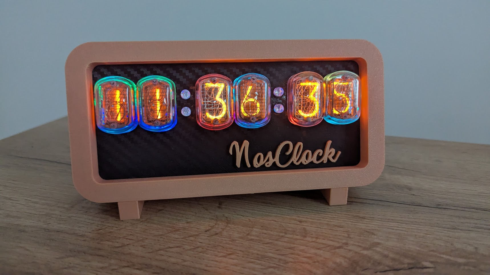
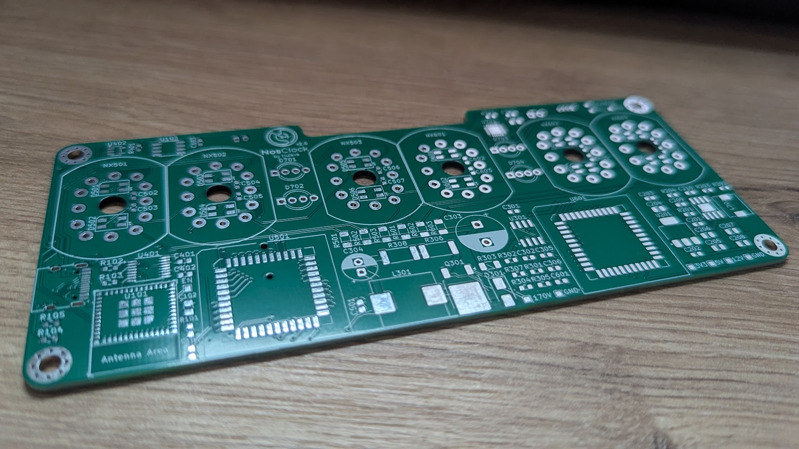
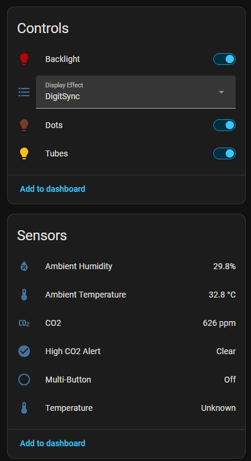
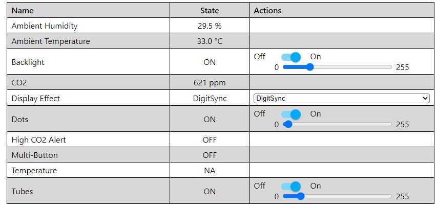

# NosClock

[](https://send.monobank.ua/jar/8Sp4xhmNX3)

**NosClock** is a smart 6-digit Nixie tube clock. It combines vintage **[IN-12 Nixie tubes](https://s.click.aliexpress.com/e/_c3cIzvbx)** with modern electronics: an **ESP32-C3** microcontroller, flicker-free high-voltage drivers, a battery-backed real-time clock, and addressable RGB backlighting. It runs on **[ESPHome](https://esphome.io/)**, so you can control it from **[Home Assistant](https://www.home-assistant.io/)** and use it in [automations](#automation-ideas) (air raid alerts, high CO2 warnings, night mode).

> [!CAUTION]
> **HIGH VOLTAGE WARNING**: This clock generates **170V DC** to power the Nixie tubes. It can cause a severe electric shock or injury. **Do not touch the PCB while it is powered.** Always unplug the power before touching, servicing, or modifying the hardware.



---

## ✨ Key Features

- **Flicker-Free High-Voltage Shift Register Driving**:
  Uses dedicated high-voltage shift register drivers (**[HV5222PJ](https://ww1.microchip.com/downloads/en/DeviceDoc/20005847A.pdf)**) instead of traditional tube multiplexing. This removes display flicker completely and allows very low tube brightness, perfect for an unobtrusive night mode.

- **Dual RGB LEDs per Digit & RGB Colons**:
  Each Nixie tube is lit from below by **two [SK6812 MINI](https://mouser.com/datasheet/2/737/SK6812MINI_REV02_EN-1501726.pdf) addressable RGB LEDs**, and every colon dot is an RGB LED (4 dots driven by the **[AW9523B](https://www.awinic.com/en/product-detail/AW9523B)** I2C driver). This enables [effects](#home-assistant) like *DigitSync*, *Scanner*, *ScannerDual*, and *ScannerSplit*.

- **Smart Home Integration (Home Assistant via ESPHome)**:
  Control tube brightness, backlight colors, effects, and display power from [Home Assistant](#home-assistant), and use the clock in [automations](#automation-ideas).

- **Dual Time Synchronization (NTP + Battery-Backed RTC)**:
  Time is synchronized via **[NTP](https://en.wikipedia.org/wiki/Network_Time_Protocol)** over Wi-Fi. When offline or after a power loss, the onboard Real-Time Clock (**[DS3231MZ](https://www.analog.com/media/en/technical-documentation/data-sheets/DS3231M.pdf)**) with a CR1220 backup battery keeps the time.

- **Expandable I2C Sensor Interface**:
  A 4-pin I2C connector (`J103`) lets you add sensors such as the **[Sensirion SCD4x](https://sensirion.com/media/documents/48C4B71E/66432D15/Sensirion_CO2_Sensors_SCD4x_Datasheet.pdf)** CO2, temperature, and humidity sensor.

---

## 🔧 Technical Specifications

NosClock uses a custom 2-layer PCB (144 × 60 mm) designed in **[KiCad](https://www.kicad.org/)**, with an enclosure designed in **[Autodesk Fusion 360](https://www.autodesk.com/products/fusion-360)**. The board has an onboard 170V DC boost converter, 32-channel high-voltage shift register drivers, and power regulation from a single 12V DC input.



- **Microcontroller**: Espressif [ESP32-C3-MINI-1](https://www.espressif.com/sites/default/files/documentation/esp32-c3-mini-1_datasheet_en.pdf) module (RISC-V 32-bit single-core CPU, 2.4GHz Wi-Fi 4, Bluetooth 5 LE).
- **Nixie Display Tubes**: 6x **[IN-12B](https://s.click.aliexpress.com/e/_c3cIzvbx)** cold-cathode Nixie tubes.
- **High-Voltage Boost Supply**: Step-up converter built around the [UC3843](https://www.ti.com/lit/ds/symlink/uc3843.pdf) PWM controller and [FQD12N20L](https://www.onsemi.com/pdf/datasheet/fqd12n20l-d.pdf) 200V MOSFET, converting 12V DC to **170V DC** for the tube anodes.
- **Low-Voltage Power Supply**:
  - [MP2307](https://www.monolithicpower.com/en/documentview/productdocument/index/doc_url/%2Fm%2Fp%2Fmp2307_r1.9.pdf) 3A synchronous buck converter: 12V → 5V.
  - [AP7361-33](https://www.diodes.com/assets/Datasheets/AP7361.pdf) 1A LDO regulator: 5V → 3.3V for the ESP32-C3 and logic.
- **Display Driver & Logic**:
  - 2x Microchip [HV5222PJ](https://ww1.microchip.com/downloads/en/DeviceDoc/20005847A.pdf) 32-channel high-voltage shift registers in PLCC-44 sockets.
  - [CD4504](https://www.ti.com/lit/ds/symlink/cd4504b.pdf) CMOS hex level shifter and [SN74LV1T34](https://www.ti.com/lit/ds/symlink/sn74lv1t34.pdf) logic buffer.
- **Timekeeping**: [DS3231MZ](https://www.analog.com/media/en/technical-documentation/data-sheets/DS3231M.pdf) I2C Real-Time Clock with CR1220 battery backup and NTP synchronization.
- **Sensors**:
  - Sensirion [SCD4x / SCD41](https://sensirion.com/media/documents/48C4B71E/66432D15/Sensirion_CO2_Sensors_SCD4x_Datasheet.pdf) CO2, temperature, and humidity sensor (optional, I2C address `0x62`).
  - Dallas [DS18B20](https://datasheets.maximintegrated.com/en/ds/DS18B20.pdf) 1-Wire temperature sensor on GPIO2.
- **RGB Backlight**: 12x [SK6812MINI](https://mouser.com/datasheet/2/737/SK6812MINI_REV02_EN-1501726.pdf) addressable RGB LEDs under the tubes, plus 4x RGB colon LEDs driven by an [AW9523B](https://www.awinic.com/en/product-detail/AW9523B) I2C LED driver.
- **Button**: push button on GPIO21 (toggles the display on/off).
- **Power & Connectivity**:
  - 12V DC input via 2-pin JST-XH connector (`J104`), see [power adapter](#you-will-also-need).
  - USB-C connector (`J101`) for flashing the firmware.

Schematics and PCB layout (KiCad): [`hardware/`](hardware/).

---

## 🛠️ How to Build Your Own NosClock

1. [Order the components](#step-1--order-the-components)
2. [Order the PCB](#step-2--order-the-pcb)
3. [Solder the board](#step-3--solder-the-board) *(guide coming soon)*
4. [3D-print the enclosure](#step-4--3d-print-the-enclosure)
5. [Flash the firmware](#step-5--flash-the-firmware)
6. [Use your clock](#step-6--use-your-clock)

---

### Step 1 — Order the components

Prices are in USD, checked on 2026-09-23. They are item prices only: shipping depends on your country and is not included.

- **Needed**: how many parts go on the board.
- **Order**: how many lots to buy × pieces per lot (sellers often sell only in packs of 2, 5, 10, etc.).
- **Total**: lot price × number of lots.

> **Note:** AliExpress prices change often, and listings can be removed or go out of stock. If a link is broken or a part is unavailable, please [open an issue](https://github.com/hulakov/NosClock/issues) so the list can be updated.

#### Nixie Tubes

| Part | Needed | Order | Lot Price | Total | Link |
|---|---|---|---|---|---|
| IN-12B (NOS) | 6 | 6 × 1 pc | $17.10 | **$102.60** | [buy](https://s.click.aliexpress.com/e/_c3cIzvbx) |

**Nixie tubes total: $102.60**

#### Components

| # | Part | Reference | Needed | Order | Lot Price | Total | Link |
|---|---|---|---|---|---|---|---|
| 1 | ESP32-C3-MINI-1 (N4) | U101 | 1 | 1 × 1 pc | $2.73 | $2.73 | [buy](https://s.click.aliexpress.com/e/_c3xMgjCH) |
| 2 | DS3231MZ SOIC-8 | U103 | 1 | 1 × 2 pcs | $5.22 | $5.22 | [buy](https://s.click.aliexpress.com/e/_c3K8PI7B) |
| 3 | AP7361-33ER-13 SOT-223 | U201 | 1 | 1 × 10 pcs | $6.95 | $6.95 | [buy](https://s.click.aliexpress.com/e/_c3g1RG4p) |
| 4 | MP2307DN-LF-Z SOIC-8 | U202 | 1 | 1 × 5 pcs | $2.02 | $2.02 | [buy](https://s.click.aliexpress.com/e/_c3VXoHP7) |
| 5 | UC3843A SOIC-8 | U301 | 1 | 1 × 10 pcs | $1.62 | $1.62 | [buy](https://s.click.aliexpress.com/e/_c2Jymwnr) |
| 6 | CD4504BPWR TSSOP-16 | U401 | 1 | 1 × 5 pcs | $2.22 | $2.22 | [buy](https://s.click.aliexpress.com/e/_c3nhAJI1) |
| 7 | SN74LV1T34DBVR SOT-23-5 | U402 | 1 | 1 × 10 pcs | $2.27 | $2.27 | [buy](https://s.click.aliexpress.com/e/_c4NBrHu5) |
| 8 | HV5222PJ PLCC-44 | U501, U601 | 2 | 2 × 1 pc | $3.68 | $7.36 | [buy](https://s.click.aliexpress.com/e/_c4b2e8wd) |
| 9 | PLCC-44 SMD socket | U501, U601 | 2 | 1 × 5 pcs | $1.42 | $1.42 | [buy](https://s.click.aliexpress.com/e/_c301jgO5) |
| 10 | AW9523BTQR QFN-24 | U701 | 1 | 1 × 5 pcs | $1.54 | $1.54 | [buy](https://s.click.aliexpress.com/e/_c37MUf2v) |
| 11 | FQD12N20L TO-252 | Q301 | 1 | 1 × 10 pcs | $2.14 | $2.14 | [buy](https://s.click.aliexpress.com/e/_c3Ir5ABP) |
| 12 | ES1J SMA | D301 | 1 | 1 × 50 pcs | $0.38 | $0.38 | [buy](https://s.click.aliexpress.com/e/_c4tBW6Tn) |
| 13 | SK6812MINI 3535 ("BL" variant) | D501–D506, D601–D606 | 12 | 1 × 50 pcs | $5.63 | $5.63 | [buy](https://s.click.aliexpress.com/e/_c4mkH7AZ) |
| 14 | RGB LED 5 mm, 4-pin, common anode (Diffused A) | D701–D704 | 4 | 1 × 20 pcs | $1.36 | $1.36 | [buy](https://s.click.aliexpress.com/e/_c4UarZrj) |
| 15 | Inductor 10 µH, 0630 | L201 | 1 | 1 × 10 pcs | $1.53 | $1.53 | [buy](https://s.click.aliexpress.com/e/_c2QJm98H) |
| 16 | Inductor 100 µH, 1040 (10×10×4 mm) | L301 | 1 | 1 × 5 pcs | $0.98 | $0.98 | [buy](https://s.click.aliexpress.com/e/_c3tJ6fpJ) |
| 17 | USB-C 16P TYPE-C-31-M-12 | J101 | 1 | 1 × 20 pcs | $5.17 | $5.17 | [buy](https://s.click.aliexpress.com/e/_c3UiLAeN) |
| 18 | JST PH 2.0 2-pin (with cable) | J102 | 1 | 1 × 10 sets | $1.18 | $1.18 | [buy](https://s.click.aliexpress.com/e/_c4LT5JFT) |
| 19 | PicoBlade 1.25 mm 4-pin, vertical SMD | J103 | 1 | 1 × 20 pcs | $0.85 | $0.85 | [buy](https://s.click.aliexpress.com/e/_c3mqOP8z) |
| 20 | JST XH 2.54 2-pin (12 V input) | J104 | 1 | 1 × 10 sets | $0.94 | $0.94 | [buy](https://s.click.aliexpress.com/e/_c4mU6YRR) |
| 21 | CR1220 SMD battery holder | BT101 | 1 | 1 × 10 pcs | $1.49 | $1.49 | [buy](https://s.click.aliexpress.com/e/_c4tPLXGV) |
| 22 | Resistor kit 0603 (80 values × 50 pcs): 10R, 330R, 1K, 4.7K ×3, 5.1K ×2, 6.8K, 7.5K, 10K ×2, 30K, 47K, 100K, 150K | R101–R307, R401, R701 | 17 | 1 kit | $5.62 | $5.62 | [buy](https://s.click.aliexpress.com/e/_c2JDtiGD) |
| 23 | Resistor 1206 20K | R501–R503, R601–R603 | 6 | 1 × 100 pcs | $2.25 | $2.25 | [buy](https://s.click.aliexpress.com/e/_c3f9k8vb) |
| 24 | Resistor 1206 680K | R303 | 1 | 1 × 100 pcs | $1.54 | $1.54 | [buy](https://s.click.aliexpress.com/e/_c4BS86Sl) |
| 25 | Resistor 2512 0.25R (R250) | R306, R308 | 2 | 1 × 20 pcs | $0.55 | $0.55 | [buy](https://s.click.aliexpress.com/e/_c42NNZqh) |
| 26 | Capacitor 0603 100nF 50V | 23 positions | 23 | 1 × 200 pcs | $2.10 | $2.10 | [buy](https://s.click.aliexpress.com/e/_c3ccEhY9) |
| 27 | Capacitor kit 0603 (16 values × 20 pcs): 1nF ×2, 10nF, 100pF | C305, C306, C201, C302 | 4 | 1 kit | $2.35 | $2.35 | [buy](https://s.click.aliexpress.com/e/_c3myvgN3) |
| 28 | Capacitor 0603 3.9nF 50V | C210 | 1 | 1 × 100 pcs | $1.50 | $1.50 | [buy](https://s.click.aliexpress.com/e/_c4WOeHQD) |
| 29 | Capacitor 0805 10uF | C204–C206, C702 | 4 | 1 × 100 pcs | $1.22 | $1.22 | [buy](https://s.click.aliexpress.com/e/_c34ZUVWt) |
| 30 | Capacitor 0805 22uF | C207, C208 | 2 | 1 × 100 pcs | $1.75 | $1.75 | [buy](https://s.click.aliexpress.com/e/_c3dSRT0z) |
| 31 | Capacitor 0805 1uF | C102 | 1 | 1 × 100 pcs | $1.03 | $1.03 | [buy](https://s.click.aliexpress.com/e/_c2I0ySdj) |
| 32 | Electrolytic capacitor 4.7uF 400V (D10 mm, P5 mm) | C303 | 1 | 1 × 20 pcs | $0.88 | $0.88 | [buy](https://s.click.aliexpress.com/e/_c3bL90ut) |
| 33 | Electrolytic capacitor 220uF 35V (D6.3 mm, P2.5 mm) | C304 | 1 | 1 × 20 pcs | $3.79 | $3.79 | [buy](https://s.click.aliexpress.com/e/_c3tpnO1T) |

**Components total: $79.58**

#### Grand Total

| | Total |
|---|---|
| Nixie tubes | $102.60 |
| Components | $79.58 |
| **Grand total (excluding shipping)** | **$182.18** |

#### You will also need

- A **12 V DC power adapter** (at least 1 A). Connect it to the JST XH connector from [row 20](#components).
- A **CR1220 coin cell battery** for the [clock backup](#-technical-specifications) (keeps the time when the power is off).
- A **USB-C data cable** for flashing the firmware (a charge-only cable will not work).
- *(Optional)* A **Sensirion SCD41** module with a 4-pin PicoBlade 1.25 mm cable if you want CO2, temperature and humidity readings ([datasheet](https://sensirion.com/media/documents/48C4B71E/66432D15/Sensirion_CO2_Sensors_SCD4x_Datasheet.pdf)). It plugs into `J103`.

---

### Step 2 — Order the PCB

The PCB is ordered as a bare board (no parts soldered). You solder the components from [Step 1](#step-1--order-the-components) yourself ([Step 3](#step-3--solder-the-board)).

1. Download the Gerber file: **[NosClock.zip](hardware/production/NosClock.zip)**. Do not unzip it.
2. Open [jlcpcb.com](https://jlcpcb.com/) and click **Add gerber file**. Upload `NosClock-gerber.zip`.
3. JLCPCB reads most settings from the file. Check that they look like this:

   | Setting | Value |
   |---|---|
   | Base Material | FR-4 |
   | Layers | 2 |
   | Dimensions | 144 × 60 mm (filled in automatically) |
   | PCB Qty | 5 (the minimum order) |
   | PCB Thickness | 1.6 mm |
   | PCB Color | any color you like |
   | Surface Finish | HASL (lead-free) or ENIG. ENIG is flatter and makes the small chips easier to solder |
   | PCB Assembly | **off** |

4. *(Optional, recommended)* Turn on **SMT Stencil**. A stencil makes it much easier to apply solder paste to the small chips.
5. Click **Save to Cart**, then check out and pick a shipping method.

---

### Step 3 — Solder the board

> [!NOTE]
> **A detailed step-by-step soldering guide is coming soon.**

The [interactive BOM](hardware/bom/ibom.html) shows where each part goes on the board. Download the file and open it in your browser.

---

### Step 4 — 3D-print the enclosure

1. Download the STL files from the [`enclosure/`](enclosure/) folder.
2. Print them with **PLA** or **PETG**. A 0.2 mm layer height works well.
3. Put the soldered board with the tubes into the enclosure.

---

### Step 5 — Flash the firmware

The clock runs on **[ESPHome](https://esphome.io/)**. The easiest way to flash it is with the **[ESPHome Device Builder](https://esphome.io/guides/getting_started_hassio/)** add-on in [Home Assistant](https://www.home-assistant.io/). You only need a USB cable for the first flash. After that, updates install over Wi-Fi.

#### 5.1 Install ESPHome Device Builder

1. [Open the ESPHome Device Builder add-on in your Home Assistant](https://my.home-assistant.io/redirect/supervisor_addon/?addon=5c53de3b_esphome&repository_url=https%3A%2F%2Fgithub.com%2Fesphome%2Fhome-assistant-addon) (or go to **Settings → Add-ons → Add-on Store** and find **ESPHome Device Builder**).
2. Click **Install**, then **Start**, then **Open Web UI**.

#### 5.2 Add the NosClock configuration

1. In ESPHome Device Builder, click **Secrets** (top-right corner) and add these lines with your own values:
   ```yaml
   wifi_ssid: "Your_WiFi_Name"
   wifi_password: "Your_WiFi_Password"
   nosclock_ap_password: "Any_Password_For_Fallback_Hotspot"
   nosclock_api_key: "Your_API_Encryption_Key"
   nosclock_ota_password: "Any_Password_For_Updates"
   ```
   To get `nosclock_api_key`, open the [ESPHome API page](https://esphome.io/components/api.html#configuration-variables). It generates a random key for you. Copy the key and save it somewhere, because you will need it again in [step 5.4](#54-add-the-clock-to-home-assistant).
2. Click **+ New Device** → **Continue** → enter the name `nosclock` → choose **ESP32-C3** → **Skip**.
3. On the new `nosclock` card, click **Edit**. Delete everything in the file and paste the contents of [`esphome/nosclock.yaml`](esphome/nosclock.yaml). Click **Save**.
4. *(Optional)* In the file, change `timezone: "Europe/Kiev"` to [your time zone](https://en.wikipedia.org/wiki/List_of_tz_database_time_zones) and `altitude_compensation: 180m` to your altitude.

#### 5.3 Flash over USB (first time only)

1. On the `nosclock` card, click **⋮ → Install → Manual download**. Wait for the build to finish (the first build takes a few minutes), then choose **Factory format** to download the `.bin` file.
2. Connect the clock to your computer with the USB-C cable.
3. Open [web.esphome.io](https://web.esphome.io) in **Chrome** or **Edge**. Click **Connect** and select the clock's serial port.
4. Click **Install**, select the downloaded `.bin` file, and wait until it finishes.

#### 5.4 Add the clock to Home Assistant

1. Unplug the USB cable and power the clock from the [12 V adapter](#you-will-also-need). It connects to your Wi-Fi.
2. In Home Assistant, go to **[Settings → Devices & services](https://my.home-assistant.io/redirect/integrations/)**. You will see **NosClock** as a discovered device. Click **Configure**.
3. When it asks for the encryption key, paste your `nosclock_api_key` from [step 5.2](#52-add-the-nosclock-configuration).

To install future updates, click **⋮ → Install → Wirelessly** on the `nosclock` card. You do not need the USB cable anymore.

> [!TIP]
> If the clock cannot connect to your Wi-Fi (for example, the password is wrong), it creates its own Wi-Fi network called **NosClock Fallback Hotspot**. Connect to it with your `nosclock_ap_password`. A page opens where you can choose your Wi-Fi network.

<details>
<summary>Advanced: flash with the ESPHome command line instead</summary>

1. [Install ESPHome](https://esphome.io/guides/installing_esphome/): `pip install esphome`
2. Clone [this repository](https://github.com/hulakov/NosClock) and create `esphome/secrets.yaml` with the same lines as in [step 5.2](#52-add-the-nosclock-configuration).
3. Connect the clock via USB-C and run:
   ```bash
   esphome run esphome/nosclock.yaml
   ```
</details>

---

### Step 6 — Use your clock

The clock gets the time from the internet over Wi-Fi. When there is no internet, it keeps time with its built-in battery-backed clock.

#### Button

- **Press**: turns the tubes and the backlight on or off.

#### Home Assistant

Go to **[Settings → Devices & services](https://my.home-assistant.io/redirect/integrations/) → ESPHome → NosClock** to control the clock:

- **Tubes** (light): turn the tubes on or off and set their brightness.
- **Backlight** (light): the color and brightness of the RGB lights under the tubes.
- **Dots** (light): the color and brightness of the colon dots.
- **Display Effect** (select): the backlight effect. The options are `Solid`, `Static`, `DigitSync`, `Scanner`, `ScannerDual`, `ScannerSplit`, and `Cycle`.
- **Sensors**: Temperature. With the [optional SCD41 module](#you-will-also-need) you also get CO2, Ambient Temperature, Ambient Humidity, and **High CO2 Alert** (turns on above 1500 ppm).

You can also open the clock's web page at [http://nosclock.local](http://nosclock.local).





#### Automation ideas

- **Air raid alerts (Повітряна тривога)**: install the [NosAlert](https://github.com/hulakov/NosAlert) integration and [create an automation](https://www.home-assistant.io/docs/automation/basics/) that changes the backlight color or effect when an alert starts in your region.
- **Night mode**: lower the tube brightness at night and turn it back up in the morning.
- **High CO2 warning**: flash the backlight red when **High CO2 Alert** turns on.

---

## 💛 Support the Project

If you like NosClock, you can support its development:

[](https://send.monobank.ua/jar/8Sp4xhmNX3)

---

## 📄 License

This project is licensed under open-source terms. See project files for details.
